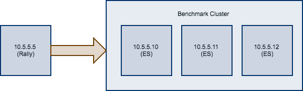

# 技巧和窍门
本节以食谱风格介绍各种技巧。

## 对现有集群进行基准测试

```warning:: 如果您刚开始使用Rally，但不了解其工作原理，请不要在任何生产或类似生产的集群上运行它。此外，应该在专用环境中执行基准测试,该环境不应该有流量干扰
```

```note:: 在此配方中，我们假设Rally已正确配置。
```
假如你现在有一个待测试的集群，由在`10.5.5.10`、`10.5.5.11`、`10.5.5.12`上运行的三个Elasticsearch节点组成。您已经自行设置了群集，并希望使用Rally对它进行基准测试。 Rally安装在`10.5.5.5`上。


首先，我们需要确定一个track。因此，我们通常运行`esrally list tracks`：
```
Name        Description                                          Documents  Compressed Size    Uncompressed Size    Default Challenge        All Challenges
----------  -------------------------------------------------  -----------  -----------------  -------------------  -----------------------  ---------------------------
geonames    POIs from Geonames                                    11396505  252.4 MB           3.3 GB               append-no-conflicts      append-no-conflicts,appe...
geopoint    Point coordinates from PlanetOSM                      60844404  481.9 MB           2.3 GB               append-no-conflicts      append-no-conflicts,appe...
http_logs   HTTP server log data                                 247249096  1.2 GB             31.1 GB              append-no-conflicts      append-no-conflicts,appe...
nested      StackOverflow Q&A stored as nested docs               11203029  663.1 MB           3.4 GB               nested-search-challenge  nested-search-challenge,...
noaa        Global daily weather measurements from NOAA           33659481  947.3 MB           9.0 GB               append-no-conflicts      append-no-conflicts,appe...
nyc_taxis   Taxi rides in New York in 2015                       165346692  4.5 GB             74.3 GB              append-no-conflicts      append-no-conflicts,appe...
percolator  Percolator benchmark based on AOL queries              2000000  102.7 kB           104.9 MB             append-no-conflicts      append-no-conflicts,appe...
pmc         Full text benchmark with academic papers from PMC       574199  5.5 GB             21.7 GB              append-no-conflicts      append-no-conflicts,appe...
```
假如我们对全文基准感兴趣，我们选择pmc运行。如果您有要用于基准测试的数据，请[创建自己的track](add_tracks.md),与默认track相比，您收集的指标将更具代表性和实用性。
接下来，我们需要知道要针对哪些机器，这很容易，因为从上图可以看到。

最后，我们需要检查要使用的管道。对于这种情况，`benchmark-only`管道是合适的，因为我们不希望Rally为我们配置集群。
现在我们可以调用Rally：
```
esrally --track=pmc --target-hosts=10.5.5.10:9200,10.5.5.11:9200,10.5.5.12:9200 --pipeline=benchmark-only
```
如果启用了[X-Pack Security](https://www.elastic.co/products/x-pack/security)，则还需要指定另一个参数以使用https并传递凭据：
```
esrally --track=pmc --target-hosts=10.5.5.10:9243,10.5.5.11:9243,10.5.5.12:9243 --pipeline=benchmark-only --client-options="use_ssl:true,verify_certs:true,basic_auth_user:'elastic',basic_auth_password:'changeme'"
```
